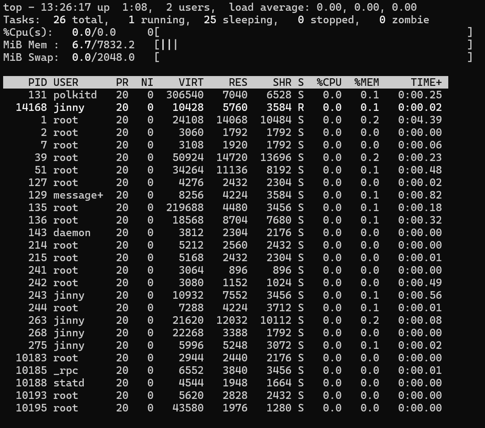

# Process Management
## Listing processes, Identifying PIDs, Killing Processes, Process Signals, Background and Foreground jobs, Nohup

`ps`
```bash
#Listing processes
ps #Lists the processes run by the user

ps -ef #Lists all the processes with PID, PPID

ps aux #Lists all the processes with more information such as PID, Memory usage, CPU usage

ps -ejH
        --> #Lists the processe tree
ps aux
```

`top: Real time process monitoring`
```bash
top #shows the real time interface for the processes running

#multiple flags inside the top intergace can be used to filter out the processes based on the mentioned criteria

m #shows the aggregate memore usage
t #shows the aggregate cpu usage
u #filter processes based on the user
d #change the delay time - by-default 3 sec.
F #Forest view - parent-child tree
n #no. of tasks to be displayed
k #kill a process
r #renice: set the process priority
```

`top`


```bash
#Killing the processes
kill PID #specify the process id to be killed

#process signals
kill -l #lists the process signals, in all there are 64 all for different purposes

#process signals offered by kill command
 1) SIGHUP       2) SIGINT       3) SIGQUIT      4) SIGILL       5) SIGTRAP
 6) SIGABRT      7) SIGBUS       8) SIGFPE       9) SIGKILL     10) SIGUSR1
11) SIGSEGV     12) SIGUSR2     13) SIGPIPE     14) SIGALRM     15) SIGTERM
16) SIGSTKFLT   17) SIGCHLD     18) SIGCONT     19) SIGSTOP     20) SIGTSTP
21) SIGTTIN     22) SIGTTOU     23) SIGURG      24) SIGXCPU     25) SIGXFSZ
26) SIGVTALRM   27) SIGPROF     28) SIGWINCH    29) SIGIO       30) SIGPWR
31) SIGSYS      34) SIGRTMIN    35) SIGRTMIN+1  36) SIGRTMIN+2  37) SIGRTMIN+3
38) SIGRTMIN+4  39) SIGRTMIN+5  40) SIGRTMIN+6  41) SIGRTMIN+7  42) SIGRTMIN+8
43) SIGRTMIN+9  44) SIGRTMIN+10 45) SIGRTMIN+11 46) SIGRTMIN+12 47) SIGRTMIN+13
48) SIGRTMIN+14 49) SIGRTMIN+15 50) SIGRTMAX-14 51) SIGRTMAX-13 52) SIGRTMAX-12
53) SIGRTMAX-11 54) SIGRTMAX-10 55) SIGRTMAX-9  56) SIGRTMAX-8  57) SIGRTMAX-7
58) SIGRTMAX-6  59) SIGRTMAX-5  60) SIGRTMAX-4  61) SIGRTMAX-3  62) SIGRTMAX-2
63) SIGRTMAX-1  64) SIGRTMAX

kill -9 PID #to forcefull kill the process
kill -19 PID #to temporarily stop the process
kill -18 PID #to continue the process stopped
```

`renice, fg, bg`
```bash
#renice - Used to change the nice value (priority) of a running process.
#The nice value ranges from -20 (highest priority) to 19 (lowest priority).
#A lower nice value means higher scheduling priority.
renice -n -10 PID #set the nice value to -10

#Foreground and Background Jobs/Processes – We can move running processes to the background so they continue executing while freeing up the terminal for other tasks.
🧠 #Managing Background Processes in Linux
#You can move jobs/processes to the **background** in two ways:

# 1. Start the process directly in the background using `&`:
command &

#2. Move a running process to the background:
# Step 1: Start the command normally
some_command

# Step 2: Press Ctrl + Z to suspend it

# Step 3: Run 'bg' to continue it in the background
bg

📋 #View Background Jobs
#You can list background jobs started in the current terminal session using:
jobs

💡 #Tip: You can bring a background job back to the foreground using:
fg %<job_number>

And terminate it using:
kill %<job_number>
```

`nohup`
```bash
nohup some_command & #nohup igonre the SIGHUP signal which is called when a the terminal is closed
#so here the command will not be closed even after the terminal is closed

💡 #Pro Tip:Use disown after nohup to fully detach the job from the terminal:
nohup some_command & disown
or
disown %<job_number> #to detach the specific job id from terminal
```